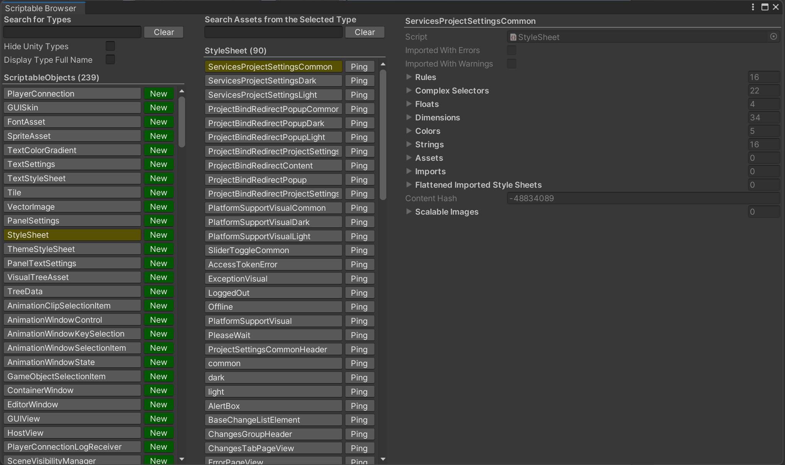

# ScriptableObject Browser
An Unity Editor tool to browse, edit, and create ScriptableObject instances in projects.

|  |
| --- |

# Features
- Search, create, and find all ScriptableObjects in your project.
- Easily navigable UI split into 3 columns.
- No longer needed to write `CreateAssetMenu` attributes for ScriptableObject scripts.

# Installation And Quick Start
There are several ways to install this package into your Unity project:

- Unity Package Manager
  - In the Unity Editor, go to `Window` > `Package Manager`.
  - In the Package Manager window, click on the top left plus (+) icon, and then click `Add package from git URL...`.
  - Paste the following link: `https://github.com/huchi57/ScriptableObjectBrowser.git`, and then click on `Add`.
- Plain Install
  - Clone / download this repository and put it under your project's Asset folder.

After installation, you should be able to access **ScriptableObject Browser** by one of the two menu items:
- `Window` > `OwO` > `ScriptableObject Browser`.
- `OwO` > `Window` > `ScriptableObject Browser`.

# Manual
**ScriptableObject Browser** is split into 3 columns. From left to right:
- Type Selection Panel
  - This panel contains all available ScriptableObject types. Click on a type to see all of its asset instances, or click on `New` to create a new asset of the type.
- Asset Selection Panel
  - This panel will show all asset instances of the selected type. Click on an item to inspect it in the right panel.
- Asset Inspector
  - If an asset is selected, this panel will show the details and fields of that asset, as if you are editing it in the usual Inspector panel.
 
Here are the field names and their descriptions in the window:

| Field | Description |
| --- | --- |
| Search for Types | This keyword will be used to locate all ScriptableObject types in the project. It will look in all assemblies. |
| Hide Unity Types | When enabled, Unity ScriptableObjects will be ignored in the search results. |
| Display Type Full Name | When enabled, full namespaces will be displayed. |
| Search Asset from the Selected Type | When a type is selected in the left column, this keyword will look for assets that contains this keyword in the file name. |
